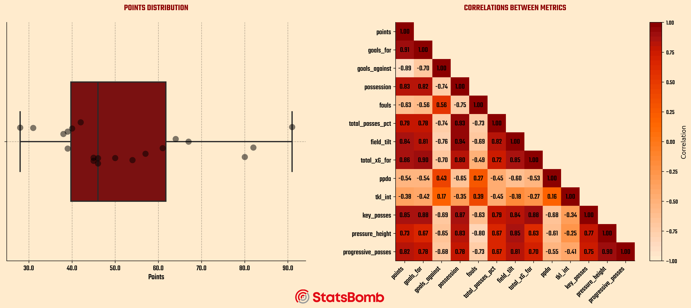
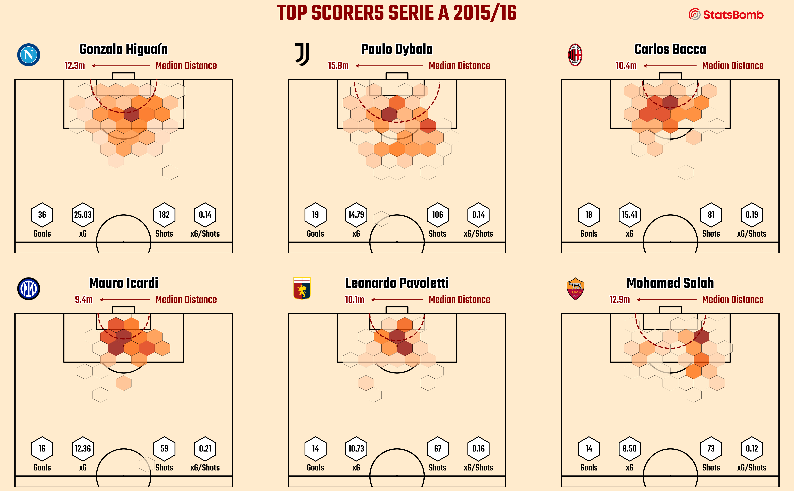
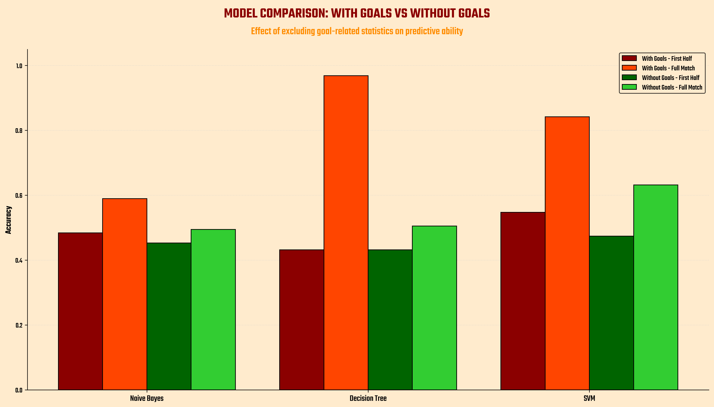

# ⚽ Predicting Match Outcomes from First-Half Statistics

This project investigates the predictive power of first-half football statistics in determining the final result of a match. Using detailed event-level data from the 2015/16 Serie A season provided by StatsBomb, we combined statistical testing, feature engineering, and machine learning to assess the relationship between the first and second halves of football matches.

> **Disclaimer:** This project is purely educational and results may be improved further.

---

## 📊 Dataset Description

The analysis is based on two datasets:
- `df_events`: Event-by-event data for every match, including actions like passes, shots, and tackles with coordinates and contextual info.
  The full dataset (~900MB) is available [here](https://drive.google.com/file/d/16lFAesb_FKpVF8jMg8jLmi0XSZ-KVnmA/view?usp=share_link).
- `df_agg`: Aggregate match information including final score, teams, matchday, and kickoff time.

A variety of new tables were created:
- A **league table** enriched with advanced metrics (Expected Goals, PPDA, possession, Field Tilt).
- A **match results** table aggregating first-half and full-match statistics per team per game.

---

## 🧠 Project Structure

The project is structured in three phases:

### 1. Descriptive Analysis
Initial exploration through visualizations and metrics to understand team characteristics, game trends, and the distribution of key statistics. We emphasize comparisons between first and second half performances.
#### Example viz

### 2. Feature Engineering
Raw event data is transformed into team-level aggregates. First-half statistics are extracted and compared to full-match data to identify early-game patterns with predictive potential.

### 3. Modeling
Classification models are built to predict the final result:
- One set using **only first-half statistics**
- One set using **entire match statistics**

We evaluate model performance to understand the added value of full-game data over first-half-only inputs.

---

## ❓ Research Question

**To what extent are first-half football statistics predictive of the final result, and which metrics carry the most influence?**

We addressed this question via:
- Statistical independence testing using Chi-square and Cramer's V
- Model performance comparison between first-half and full-match models
- Feature importance analysis (with and without goal-related metrics)

---

## 🔍 Results

- **Cramer's V = 0.494**, indicating a **moderate but meaningful relationship** between first-half and final outcomes
- **62.63% of matches** ended with the **same result as at halftime**
- **SVM** performed best among classifiers, reaching:
  - **55% accuracy** using only first-half data
  - **AUC = 0.72**, showing reliable separation between classes
- Removing goal-related stats (goals, xG) led to:
  - **Only a 3.51% accuracy drop** for first-half models
  - **A 25.61% drop** for full-match models

These findings suggest that while goal stats are highly predictive, other features (xG, shots on target, duels won) also carry valuable predictive insight.

---

## 📌 Conclusion

This research investigated the relationship between the first half and the final result in football matches, through a rigorous methodological approach that combined classical statistical analysis and machine learning models. The Cramer's V index of 0.494 revealed a moderate but significant association, confirmed by the observation that 62.63% of matches end with the same result as the first half.

The implementation of different classifiers, supported by cross-validation techniques and ROC analysis, allowed us to precisely quantify the predictive capacity of first-half statistics. SVM proved to be the most effective model in identifying patterns in partial data, achieving an accuracy of 55% and an AUC of 0.72, significantly higher than random prediction.

The comparative analysis between models with and without goal statistics revealed particularly interesting aspects: while the absence of these metrics reduced the accuracy of the complete match by 25.61%, the impact on first-half models was surprisingly contained (only 3.51%). This suggests that although goals are determinant, other statistics such as Expected Goals, shots on target, and duels won contain almost equivalent predictive information.

These results provide an empirical basis for understanding the dynamics of football matches: the first half is not simply a prologue, but contains significant predictive signals about the final outcome. For coaches, analysts, and enthusiasts, this research offers quantitative tools to interpret what happens in the first 45 minutes and how this may influence the final result.

In an era where data analysis is transforming the understanding of football, this study demonstrates that by combining traditional statistics with advanced machine learning techniques, it is possible to reveal hidden patterns that govern the evolution of matches, opening new perspectives for both tactical analysis and strategic decisions.

---

## ⚙️ Tech Stack

- **Python**: pandas, numpy, matplotlib, seaborn, scikit-learn, scipy
- **Jupyter Notebooks**: used for analysis, plotting, and experiments
- **Machine Learning Models**: SVM, Random Forest, Logistic Regression
- **Statistical Tests**: Chi-square, Cramer's V, correlation matrices

---

## Educational Purpose

This project is designed for **didactic purposes** and serves as an introduction to data-driven football analysis. Model performance and feature selection can certainly be optimized further, but the current implementation offers a solid base for understanding key concepts in sports analytics, feature engineering, and predictive modeling.

---

*Author: Alfonso Marino*  
*License: MIT* — you’re free to use, modify, and distribute it with attribution.
*Data Source: [StatsBomb Open Data](https://github.com/statsbomb/open-data)*
